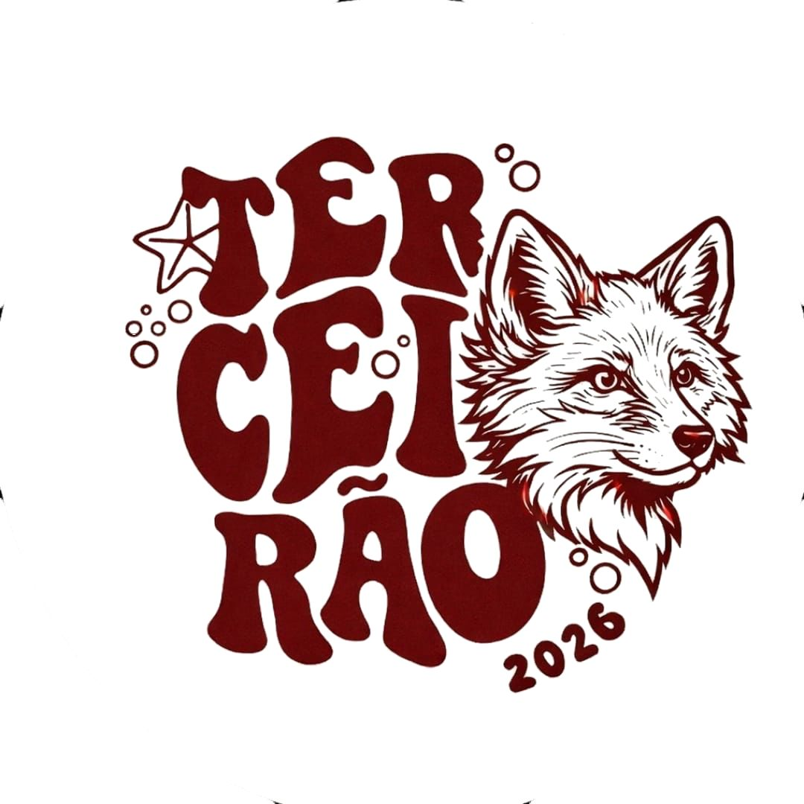

<div align="center">



# 🎓 Site Oficial • Terceirão A – Gusmão

Portal digital da turma para registrar **memes, vídeos, trotes e momentos engraçados do último ano do ensino médio.**

</div>

---

# 🚀 Funcionalidades

### 📺 Feed de Vídeos

* Vídeos em formato **Reels (9:16)**
* Sistema de **curtidas ❤️**
* **Selo "NOVO"** para vídeos recentes
* **Vídeo destaque da semana ⭐**

### 📢 Mural de Avisos

* Informações da turma
* Eventos
* Trotes
* Novidades

### 🗓️ Horários da Sala

Tabela com o horário semanal das aulas.

### 👤 Perfil da Turma

Seção com:

* Logo do Terceirão
* Estatísticas de visualizações
* Bio da turma
* Link direto para o Instagram

### 🔎 Pesquisa de Avisos

Permite **filtrar avisos rapidamente**.

### 📱 Redes da Turma

* Instagram
* TikTok

---

# 🛠 Tecnologias Utilizadas

* HTML5
* CSS3
* JavaScript
* Font Awesome

---

# 📂 Estrutura do Projeto

```
terceirao-site
│
├── index.html
├── Feed.html
├── README.md
│
├── videos
│   ├── video1.mp4
│   ├── video2.mp4
│   └── video3.mp4
│
└── imagens
    └── Logotipo-removebg-preview.png
```

---

# 🎯 Objetivo do Projeto

Registrar e guardar os **momentos mais marcantes do Terceirão A**, como:

* memes da sala
* momentos engraçados
* vídeos virais
* trotes
* eventos da escola

Assim a turma terá **uma lembrança digital do último ano do ensino médio**.

---

# 📸 Redes da Turma

Instagram
https://www.instagram.com/terceiraogussmao/

TikTok
https://www.tiktok.com/@terceiraogussmao

---

# 💻 Desenvolvimento

Projeto desenvolvido para o **Terceirão A – Gusmão**.

© 2026 • Todos os direitos reservados
